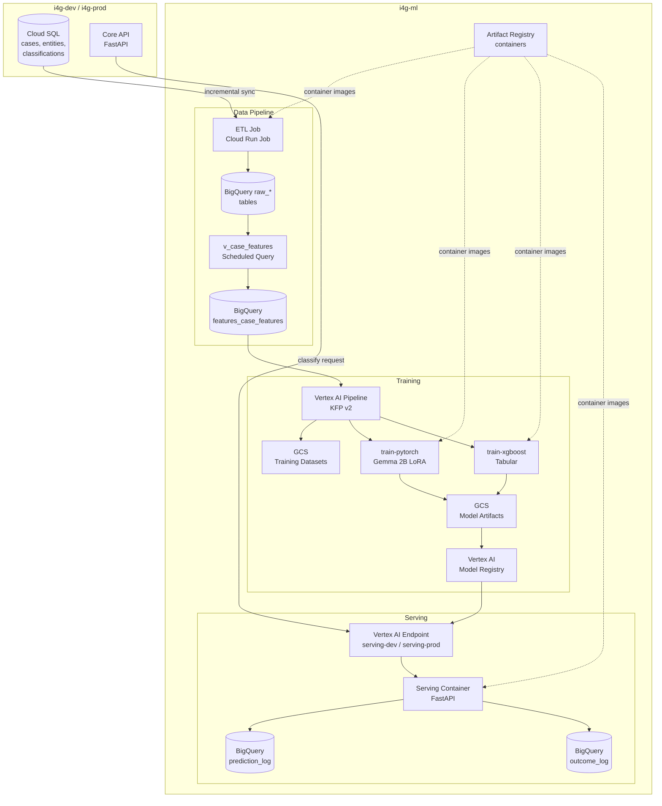

# ML Platform Architecture

## System Overview

The ML Platform provides automated fraud classification for the I4G Platform. It ingests case data from
the Core application, trains classification models, and serves predictions via a REST API.

## Architecture Diagram

## Data Flow

1. **ETL** — Cloud Run Job runs daily at 2 AM UTC. Uses watermark-based incremental sync to copy new/updated
   rows from Core Cloud SQL into BigQuery `raw_*` tables (cases with classification_result JSON, entities,
   analyst_labels).

2. **Feature Engineering** — A scheduled BigQuery query materializes `v_case_features` (a view joining raw
   tables with computed features) into the `features_case_features` table.

3. **Dataset Creation** — `create_dataset_version()` joins features with analyst labels, validates the
   dataset (min samples, class balance, null rates), performs stratified 70/15/15 split, exports JSONL to
   GCS, and registers the version in `training_dataset_registry`.

4. **Training** — KFP v2 pipeline runs on Vertex AI with 5 stages: prepare_dataset → train_model →
   evaluate_model → register_model → deploy_model. Supports Gemma 2B LoRA (PyTorch) and XGBoost (tabular)
   via separate container images.

5. **Evaluation & Promotion** — Per-axis precision/recall/F1 computed against a golden test set. Eval gate
   checks overall F1 ≥ champion and no per-axis regression > 5%. Models progress through stages:
   experimental → candidate → champion.

6. **Serving** — FastAPI app behind Vertex AI Endpoint exposes `/predict/classify` and `/feedback`.
   Predictions and outcomes are logged to BigQuery for monitoring.

7. **Integration** — Core's `MLPlatformClient` calls the serving endpoint. When `inference_backend =
"ml_platform"`, the Core API routes classification through the ML Platform instead of the LLM fallback.

## Cross-Project IAM

| Principal               | Target Project | Role                    | Purpose                          |
| ----------------------- | -------------- | ----------------------- | -------------------------------- |
| `sa-ml-platform@i4g-ml` | `i4g-dev`      | `roles/cloudsql.client` | ETL reads source database        |
| `sa-core@i4g-dev`       | `i4g-ml`       | `roles/aiplatform.user` | Dev Core calls serving endpoint  |
| `sa-core@i4g-prod`      | `i4g-ml`       | `roles/aiplatform.user` | Prod Core calls serving endpoint |

## Key Components

| Component  | Location                        | Description                           |
| ---------- | ------------------------------- | ------------------------------------- |
| ETL        | `src/ml/data/etl.py`            | Incremental Cloud SQL → BigQuery sync |
| Validation | `src/ml/data/validation.py`     | Dataset quality checks                |
| Datasets   | `src/ml/data/datasets.py`       | Dataset creation, split, export       |
| PII        | `src/ml/data/pii.py`            | Regex-based PII redaction             |
| Evaluation | `src/ml/training/evaluation.py` | Per-axis P/R/F1, EvalResult           |
| Baseline   | `src/ml/training/baseline.py`   | Few-shot LLM benchmark                |
| Pipeline   | `src/ml/training/pipeline.py`   | KFP v2 5-stage pipeline               |
| Promotion  | `src/ml/registry/promotion.py`  | Eval gate + stage transitions         |
| Registry   | `src/ml/registry/models.py`     | Vertex AI Model Registry helpers      |
| Serving    | `src/ml/serving/app.py`         | FastAPI prediction API                |
| Logging    | `src/ml/serving/logging.py`     | BQ prediction/outcome logging         |
| Features   | `src/ml/serving/features.py`    | Inline feature computation            |
| Config     | `src/ml/training/config.py`     | TrainingConfig Pydantic model         |
