# ML Platform Architecture

## System Overview

The ML Platform provides automated fraud classification for the I4G Platform. It ingests case data from
the Core application, trains classification models, and serves predictions via a REST API.

## Architecture Diagram

```mermaid
graph TB
    subgraph "i4g-dev / i4g-prod"
        CoreDB[(Cloud SQL<br/>cases, entities,<br/>classifications)]
        CoreAPI[Core API<br/>FastAPI]
    end

    subgraph "i4g-ml"
        subgraph "Data Pipeline"
            ETL[ETL Job<br/>Cloud Run Job]
            BQ_RAW[(BigQuery raw_*<br/>tables)]
            BQ_FEAT[(BigQuery<br/>features_case_features)]
            SQL_VIEW[v_case_features<br/>Scheduled Query]
        end

        subgraph "Training"
            GCS_DATA[GCS<br/>Training Datasets]
            GCS_ARTIFACTS[GCS<br/>Model Artifacts]
            PIPELINE[Vertex AI Pipeline<br/>KFP v2]
            TRAIN_PT[train-pytorch<br/>Gemma 2B LoRA]
            TRAIN_XGB[train-xgboost<br/>Tabular]
            TRAIN_NER[train-ner<br/>BERT Token Clf]
            REGISTRY[Vertex AI<br/>Model Registry]
        end

        subgraph "Serving"
            ENDPOINT[Vertex AI Endpoint<br/>serving-dev / serving-prod]
            SERVE[Serving Container<br/>FastAPI]
            BQ_PRED[(BigQuery<br/>prediction_log)]
            BQ_OUT[(BigQuery<br/>outcome_log)]
        end

        subgraph "Monitoring"
            DRIFT[Drift Detection<br/>Cloud Run Job]
            RETRAIN[Retraining Trigger<br/>Cloud Run Job]
            SHADOW[Shadow Inference<br/>A/B logging]
        end

        AR[Artifact Registry<br/>containers]
    end

    CoreDB -->|incremental sync| ETL
    ETL --> BQ_RAW
    BQ_RAW --> SQL_VIEW
    SQL_VIEW --> BQ_FEAT
    BQ_FEAT --> PIPELINE
    PIPELINE --> GCS_DATA
    PIPELINE --> TRAIN_PT
    PIPELINE --> TRAIN_XGB
    PIPELINE --> TRAIN_NER
    TRAIN_PT --> GCS_ARTIFACTS
    TRAIN_XGB --> GCS_ARTIFACTS
    TRAIN_NER --> GCS_ARTIFACTS
    GCS_ARTIFACTS --> REGISTRY
    REGISTRY --> ENDPOINT
    ENDPOINT --> SERVE
    SERVE --> BQ_PRED
    SERVE --> BQ_OUT
    CoreAPI -->|classify / extract-entities| ENDPOINT
    BQ_PRED --> DRIFT
    DRIFT --> RETRAIN
    RETRAIN -->|submit pipeline| PIPELINE
    SERVE -.->|async| SHADOW
    SHADOW --> BQ_PRED
    AR -.->|container images| ETL
    AR -.->|container images| TRAIN_PT
    AR -.->|container images| TRAIN_XGB
    AR -.->|container images| TRAIN_NER
    AR -.->|container images| SERVE
```



## Data Flow

1. **ETL** — Cloud Run Job runs daily at 2 AM UTC. Uses watermark-based incremental sync to copy new/updated
   rows from Core Cloud SQL into BigQuery `raw_*` tables (cases with classification_result JSON, entities,
   analyst_labels).

2. **Feature Engineering** — A scheduled BigQuery query materializes `v_case_features` (a view joining raw
   tables with computed features) into the `features_case_features` table.

3. **Dataset Creation** — `create_dataset_version()` joins features with analyst labels, validates the
   dataset (min samples, class balance, null rates), **redacts PII** from text fields (emails, phones,
   SSNs, credit card numbers, IPs), performs stratified 70/15/15 split, exports JSONL to GCS, and registers
   the version in `training_dataset_registry`. Redaction status is recorded in the dataset registry
   (`redacted: bool` field) and in the dataset config JSON.

   PII redaction uses regex-based pattern matching (`ml.data.pii.redact_pii`) and replaces sensitive data
   with placeholder tokens (`[EMAIL]`, `[PHONE]`, `[SSN]`, `[CC]`, `[IP]`). Phase 2+ will integrate
   Google Cloud DLP for production-grade detection.

4. **Training** — KFP v2 pipeline runs on Vertex AI with 5 stages: prepare_dataset → train_model →
   evaluate_model → register_model → deploy_model. Supports Gemma 2B LoRA (PyTorch) and XGBoost (tabular)
   via separate container images.

5. **Evaluation & Promotion** — Per-axis precision/recall/F1 computed against a golden test set. Eval gate
   checks overall F1 ≥ champion and no per-axis regression > 5%. Models progress through stages:
   experimental → candidate → champion.

6. **Serving** — FastAPI app behind Vertex AI Endpoint exposes `/predict/classify` and `/feedback`.
   Predictions and outcomes are logged to BigQuery for monitoring.

7. **Integration** — Core's `MLPlatformClient` calls the serving endpoint. When `inference_backend =
"ml_platform"`, the Core API routes classification through the ML Platform instead of the LLM fallback.
   When `entity_extraction_backend = "ml_platform"`, the Core API routes entity extraction through the
   ML Platform NER endpoint instead of LLM-based extraction.

## NER Capability

The platform supports Named Entity Recognition (NER) as a second capability alongside classification.

### Entity Types

| Entity Type   | BIO Tags             | Core Schema Key    |
| ------------- | -------------------- | ------------------ |
| PERSON        | B-PERSON, I-PERSON   | `people`           |
| ORG           | B-ORG, I-ORG         | `organizations`    |
| CRYPTO_WALLET | B-CRYPTO_WALLET, ... | `wallet_addresses` |
| BANK_ACCOUNT  | B-BANK_ACCOUNT, ...  | `wallet_addresses` |
| PHONE         | B-PHONE, I-PHONE     | `contact_channels` |
| EMAIL         | B-EMAIL, I-EMAIL     | `contact_channels` |
| URL           | B-URL, I-URL         | `contact_channels` |

### Training

NER uses `dslim/bert-base-NER` as a base model, fine-tuned with `AutoModelForTokenClassification`.
Training data is exported from the `raw_entities` BigQuery table via `create_ner_dataset_version()`.
The training container is `train-ner` and the pipeline config is `pipelines/configs/ner_bert.yaml`.

### Serving

The serving container loads NER models from `NER_MODEL_ARTIFACT_URI` alongside the classification
model. NER predictions are served via `POST /predict/extract-entities` and logged to BigQuery with
`capability="ner"`. When no NER model URI is configured, the endpoint returns 503.

### Evaluation

NER evaluation uses the `seqeval` library with BIO tagging. The primary metric is entity micro F1.
Per-entity-type metrics (precision, recall, F1) are tracked for regression detection during model
promotion.

## Shadow Mode

Shadow mode runs a candidate model alongside the champion on production traffic without affecting
responses. The champion prediction is returned synchronously; the shadow prediction runs as an
async background task and is logged to `prediction_log` with `is_shadow=TRUE`.

**Activation:** Set the `SHADOW_MODEL_ARTIFACT_URI` env var on the Cloud Run service to the GCS
path of the candidate model's artifacts. Set it to empty string to disable.

**Memory guard:** After loading both models, the serving container logs total RSS. If RSS exceeds
80% of instance memory, shadow loading is skipped and a warning is logged.

**Comparison query:**

```sql
SELECT
  c.prediction_id AS champion_id,
  s.prediction_id AS shadow_id,
  c.prediction AS champion_pred,
  s.prediction AS shadow_pred
FROM `i4g-ml.i4g_ml.predictions_prediction_log` c
JOIN `i4g-ml.i4g_ml.predictions_prediction_log` s
  ON s.prediction_id = CONCAT(c.prediction_id, '-shadow')
WHERE c.is_shadow IS NOT TRUE
ORDER BY c.timestamp DESC
LIMIT 100;
```

## Graph Features (Dataflow/Beam)

Network-based features are computed via an Apache Beam pipeline that processes entity co-occurrence
across cases. The pipeline runs weekly (Sunday 4 AM UTC) as a Cloud Run Job that submits a
Dataflow job.

**Features produced:**

| Feature                  | Description                                                     |
| ------------------------ | --------------------------------------------------------------- |
| `shared_entity_count`    | Distinct entities this case shares with other cases             |
| `entity_reuse_frequency` | Average number of cases each of this case's entities appears in |
| `cluster_size`           | Size of the connected component this case belongs to            |

**Pipeline stages:**

1. Read entity-case pairs from BigQuery `raw_entities`
2. Group by entity → list of case IDs
3. Emit co-occurrence pairs for entities shared by ≥ 2 cases
4. Per-case aggregation (shared count, reuse frequency)
5. Connected components via NetworkX (single DoFn — viable at ~10K cases)
6. Merge features → write to `features_graph_features` (WRITE_TRUNCATE)

**Local development:**

```bash
python -m ml.data.graph_features --runner DirectRunner
```

**Source:** `src/ml/data/graph_features.py`

## Cross-Project IAM

| Principal               | Target Project | Role                    | Purpose                          |
| ----------------------- | -------------- | ----------------------- | -------------------------------- |
| `sa-ml-platform@i4g-ml` | `i4g-dev`      | `roles/cloudsql.client` | ETL reads source database        |
| `sa-core@i4g-dev`       | `i4g-ml`       | `roles/aiplatform.user` | Dev Core calls serving endpoint  |
| `sa-core@i4g-prod`      | `i4g-ml`       | `roles/aiplatform.user` | Prod Core calls serving endpoint |

## Key Components

| Component  | Location                        | Description                                 |
| ---------- | ------------------------------- | ------------------------------------------- |
| ETL        | `src/ml/data/etl.py`            | Incremental Cloud SQL → BigQuery sync       |
| Validation | `src/ml/data/validation.py`     | Dataset quality checks                      |
| Datasets   | `src/ml/data/datasets.py`       | Dataset creation, split, export (clf + NER) |
| PII        | `src/ml/data/pii.py`            | Regex-based PII redaction                   |
| Evaluation | `src/ml/training/evaluation.py` | Per-axis P/R/F1 + NER entity-level metrics  |
| Baseline   | `src/ml/training/baseline.py`   | Few-shot LLM benchmark                      |
| Pipeline   | `src/ml/training/pipeline.py`   | KFP v2 5-stage pipeline                     |
| Vizier     | `src/ml/training/vizier.py`     | Vertex AI Vizier hyperparameter tuning      |
| Promotion  | `src/ml/registry/promotion.py`  | Eval gate + stage transitions (clf + NER)   |
| Registry   | `src/ml/registry/models.py`     | Vertex AI Model Registry helpers            |
| Serving    | `src/ml/serving/app.py`         | FastAPI prediction API (classify + NER)     |
| Predict    | `src/ml/serving/predict.py`     | Inference logic (clf + NER + shadow)        |
| Logging    | `src/ml/serving/logging.py`     | BQ prediction/outcome logging               |
| Features   | `src/ml/serving/features.py`    | Inline feature computation                  |
| Config     | `src/ml/training/config.py`     | TrainingConfig Pydantic model               |
| Refresh    | `src/ml/data/refresh.py`        | Automated dataset refresh pipeline          |
| Drift      | `src/ml/monitoring/drift.py`    | PSI-based feature distribution drift        |
| Triggers   | `src/ml/monitoring/triggers.py` | Automated retraining trigger evaluation     |
| Cost       | `src/ml/monitoring/cost.py`     | Training cost tracking and reporting        |
| Accuracy   | `src/ml/monitoring/accuracy.py` | Shadow model comparison metrics             |

## Framework Selection Criteria

The platform supports multiple training frameworks. Selection depends on the use case:

| Criterion         | XGBoost (Tabular)                 | PyTorch — Gemma 2B LoRA               | BERT NER (Token Clf)                |
| ----------------- | --------------------------------- | ------------------------------------- | ----------------------------------- |
| **Capability**    | Classification                    | Classification                        | Named Entity Recognition            |
| **Input**         | Pre-computed BigQuery features    | Raw narrative text                    | Raw narrative text                  |
| **Training time** | < 10 min (CPU)                    | 30–60 min (GPU)                       | 15–30 min (GPU)                     |
| **Cost / run**    | ~$0.50 (n1-standard-4, no GPU)    | ~$5–10 (T4 GPU)                       | ~$3–5 (T4 GPU)                      |
| **Cold start**    | < 1 s                             | 5–10 s (model + tokenizer load)       | 3–5 s (BERT load)                   |
| **Accuracy**      | Good baseline for structured data | Higher ceiling with rich text signals | Depends on entity annotation volume |
| **When to use**   | Rapid iteration, cost-sensitive   | Production accuracy, text-heavy cases | Entity extraction from case text    |

**Decision rule:** Start with XGBoost for fast iteration and baseline metrics. Switch to PyTorch
when XGBoost plateaus and the accuracy gap justifies the GPU cost. Both frameworks share the same
label schema, eval gate thresholds, and promotion criteria — so they are interchangeable in the
pipeline.

Use `i4g-ml eval compare-frameworks` to compare evaluation metrics side-by-side.

## Champion/Challenger A/B Routing

The serving layer supports A/B traffic splitting between two model variants:

- **Champion:** the current production model (loaded from `MODEL_ARTIFACT_URI`)
- **Challenger:** a candidate model under evaluation (loaded from `CHALLENGER_MODEL_ARTIFACT_URI`)

Traffic is split by `CHALLENGER_TRAFFIC_WEIGHT` (0.0–1.0). Two split strategies are available:

| Strategy        | Behavior                                     |
| --------------- | -------------------------------------------- |
| `random`        | Uniform random roll per request              |
| `deterministic` | FNV-1a hash of `case_id` for reproducibility |

Each prediction logs a `variant` column (`champion` or `challenger`) in `prediction_log`. The
`accuracy_materialization` job computes per-variant metrics and writes to
`analytics_variant_comparison`. When `COST_AWARE_ROUTING=true`, the router selects the cheapest model
meeting a quality bar (`f1_score >= 0.8`), overriding the random/deterministic split.

## Batch Prediction

The `batch-prediction` Cloud Run Job re-classifies historical cases in bulk:

- Entry point: `i4g-ml serve batch` (CLI) / `ml.cli.serve.run_batch()` (library)
- Capabilities: `classification`, `ner`, `risk_scoring`, `embedding`
- Reads from BigQuery, runs inference in configurable batch sizes, writes to `batch_predictions`
- On-demand only (no scheduled trigger) — invoked via `make run-batch-dev`

## Vertex AI Feature Store

Online feature serving for sub-100ms feature retrieval during prediction:

- **Feature Store:** `i4g_ml_features` (Vertex AI Feature Store, 1 fixed node)
- **Entity type:** `case` (keyed by `case_id`)
- **Features:** mirrors `FEATURE_CATALOG` — text, entity, indicator, classification, structural
- **Sync:** `feature-store-sync` Cloud Run Job runs weekly (Sunday 5 AM UTC) after data refresh.
  Uses incremental watermark (`_computed_at`) to sync only new/updated features.
- **Online read:** `fetch_online_features(case_id)` in the serving container, with LRU cache
  (128 entries, 60s TTL). Falls back to `compute_inline_features()` if Feature Store is
  unavailable or returns empty.
- **Configuration:** enabled by setting `FEATURE_STORE_ID` env var on the serving container.

## Risk Scoring

Third capability on the platform — a regression model predicting case risk (0.0–1.0):

- **Model:** XGBoost regressor (`reg:squarederror` objective)
- **Features:** union of `features_case_features` + `features_graph_features`
- **Eval metrics:** MSE + Spearman rank correlation with analyst severity judgments
- **Promotion gate:** MSE ≤ champion, Spearman ≥ 0.6
- **Serving:** `POST /predict/risk-score` returns clamped float + prediction ID
- **Configuration:** `RISK_MODEL_ARTIFACT_URI` env var on the serving container

## Document Similarity

Fourth capability — finds similar cases via embedding-based search:

- **Embedding model:** sentence-transformers (default `all-MiniLM-L6-v2`, 384 dims)
- **Index:** in-process FAISS (flat L2) for < 10K cases. Matching Engine planned for Phase 4.
- **Serving:** `POST /predict/similar-cases` returns top-K case IDs + distance scores
- **Index rebuild:** on container startup, loads latest embeddings from
  `features_case_embeddings` BigQuery table → builds FAISS index. Embedding refresh runs weekly
  via `embedding-refresh` Cloud Run Job (Sunday 6 AM UTC).
- **Configuration:** `EMBEDDING_MODEL_NAME` env var on the serving container
