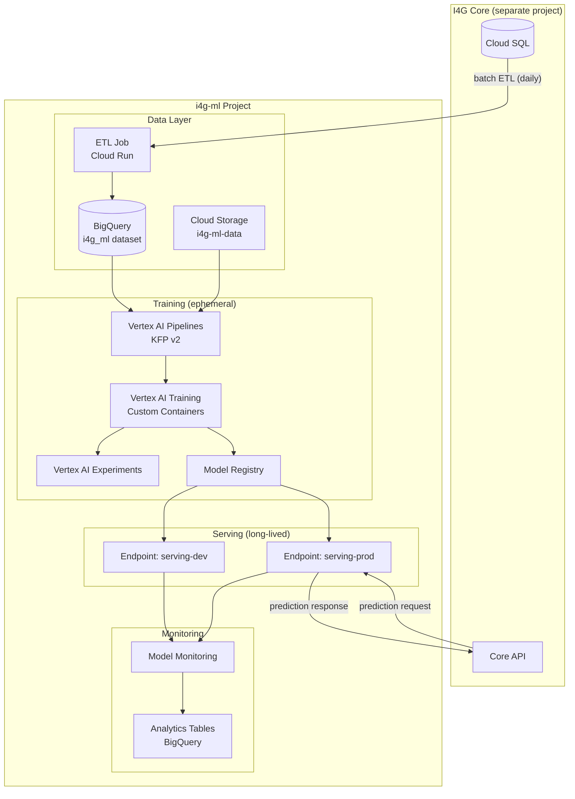
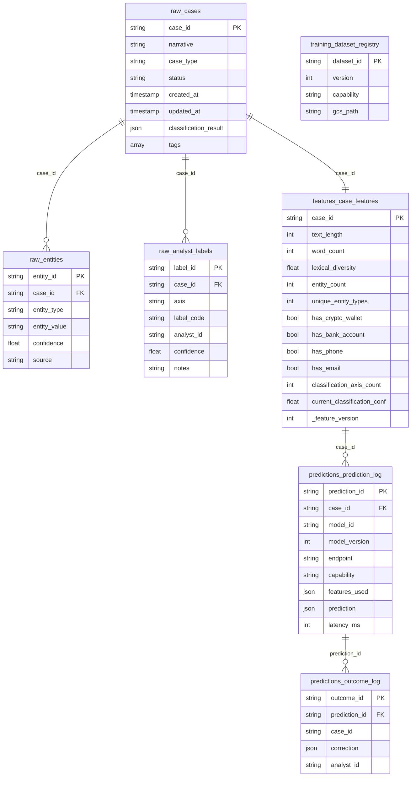
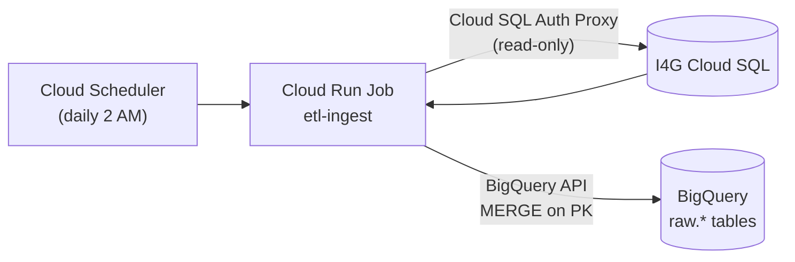
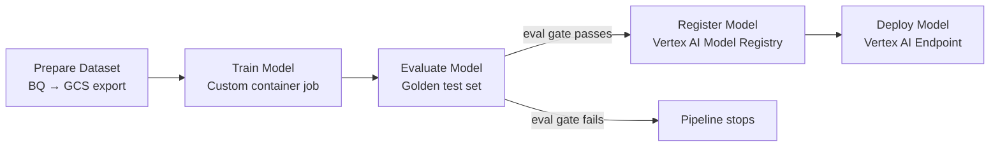
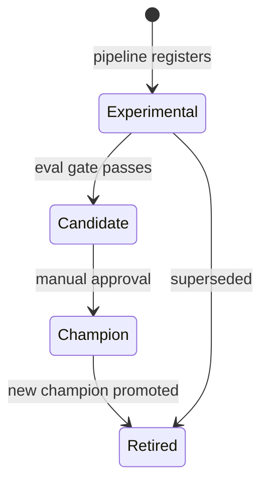
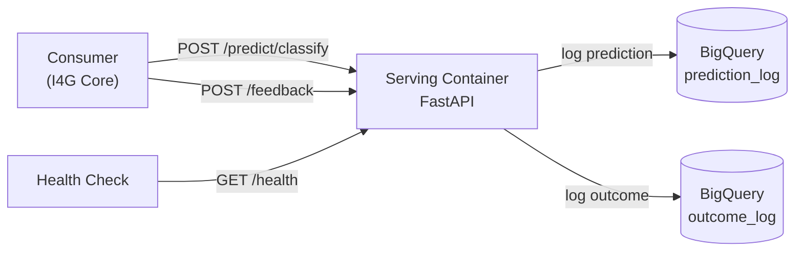
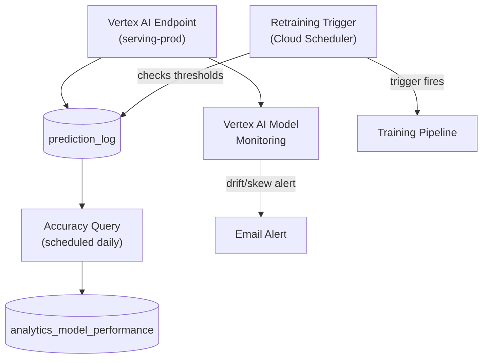
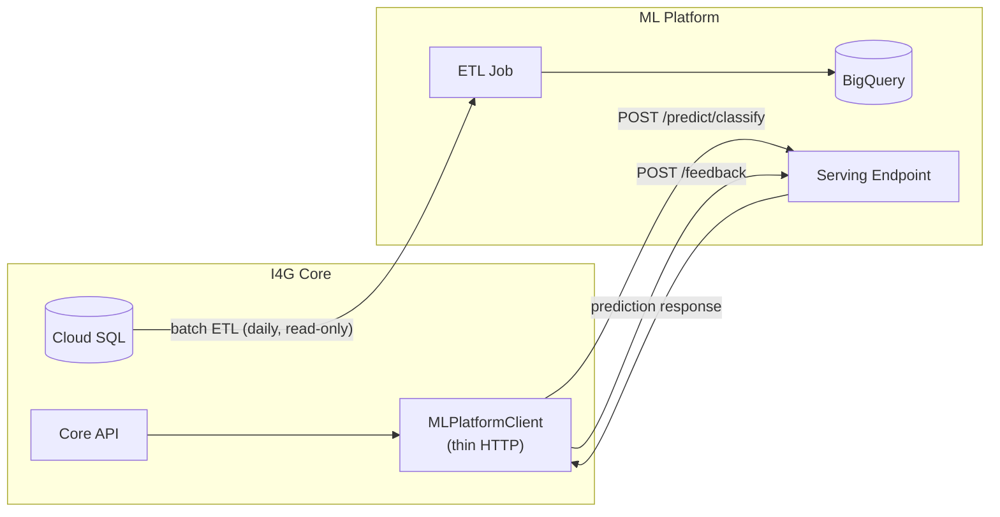
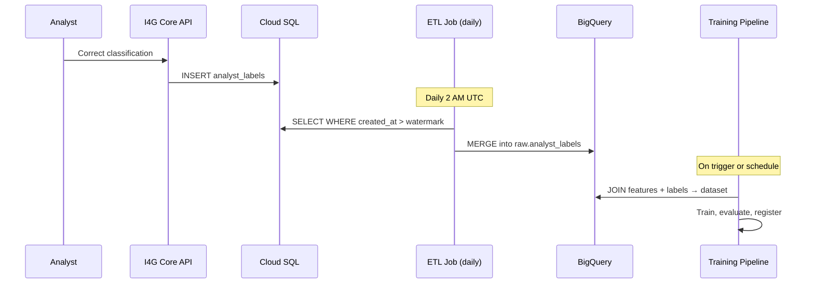
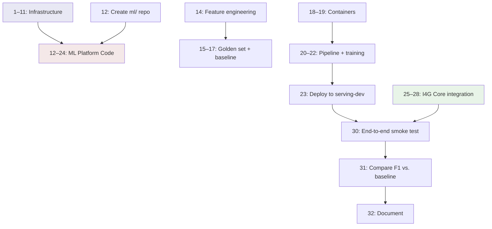

# I4G ML Platform — Technical Design Document

> **Status:** Draft
> **Date:** March 2026
> **Owner:** Engineering
> **Related PRD:** [planning/prd_ml_infrastructure.md](../../../../planning/prd_ml_infrastructure.md)
> **Related Strategy:** [planning/ml_strategy.md](../../../../planning/ml_strategy.md)
> **Implementation reference:** [ml_platform_implementation_scratchpad.md](ml_platform_implementation_scratchpad.md) — starter code for all components described here
> **Relocation note:** This TDD moves to `ml/docs/design/ml_platform_tdd.md` when the `ml/` repository is created.

---

## Table of Contents

1. [Overview](#1-overview)
2. [GCP Project & Resource Design](#2-gcp-project--resource-design)
3. [Repository Structure](#3-repository-structure)
4. [Data Layer — BigQuery & ETL](#4-data-layer--bigquery--etl)
5. [Feature Engineering](#5-feature-engineering)
6. [Training Layer](#6-training-layer)
7. [Model Registry & Promotion](#7-model-registry--promotion)
8. [Serving Layer](#8-serving-layer)
9. [Monitoring & Continuous Learning](#9-monitoring--continuous-learning)
10. [Consumer Integration](#10-consumer-integration)
11. [Infrastructure as Code (Terraform)](#11-infrastructure-as-code-terraform)
12. [Security & IAM](#12-security--iam)
13. [Phase 0 Implementation Plan](#13-phase-0-implementation-plan)

---

## 1. Overview

This TDD specifies the technical architecture of the I4G ML Platform. The platform lives in the `ml/` repository and runs in the `i4g-ml` GCP project.

Training and serving use isolated resources within the same project. Training jobs are ephemeral compute (Vertex AI Training, Pipelines) that start, execute, and terminate. Serving endpoints are long-lived infrastructure (Vertex AI Endpoints) with independent auto-scaling. They share data stores (BigQuery, Cloud Storage) but never compete for compute resources.

**Design principles:**

1. Feature-centric architecture — features are engineered, versioned, stored, served
2. Feedback-loop driven — predictions logged, outcomes captured, continuous improvement
3. Reproducible by default — any training run recreatable from data version + config + code
4. Few-shot prompting is the perpetual fallback
5. GCP-managed over self-hosted

### System Architecture



---

## 2. GCP Project & Resource Design

### 2.1 Project

| Property     | Value                                                             |
| ------------ | ----------------------------------------------------------------- |
| Project ID   | `i4g-ml`                                                          |
| Project Name | I4G ML Platform                                                   |
| Region       | `us-central1`                                                     |
| Billing      | Same billing account as `i4g-dev` / `i4g-prod`                    |
| Labels       | `team=engineering`, `product=ml-platform`, `managed-by=terraform` |

### 2.2 GCP APIs

The following APIs are enabled via Terraform:

| API                        | Purpose                                                                  |
| -------------------------- | ------------------------------------------------------------------------ |
| Vertex AI                  | Training, Pipelines, Endpoints, Experiments, Workbench, Model Monitoring |
| BigQuery (+ Data Transfer) | Data warehouse for raw data, features, predictions, analytics            |
| Cloud Storage              | Datasets, model artifacts, pipeline artifacts                            |
| Cloud Run                  | ETL jobs                                                                 |
| Cloud Scheduler            | Pipeline and ETL triggers                                                |
| Artifact Registry          | Container images for training and serving                                |
| Dataproc                   | Phase 1+ Spark jobs                                                      |
| Pub/Sub                    | Phase 1+ event-driven data pipelines                                     |
| Cloud Monitoring + Logging | Observability                                                            |
| Cloud SQL Admin            | Auth Proxy for ETL connections                                           |
| Compute Engine             | Required by Vertex AI                                                    |
| Notebooks                  | Vertex AI Workbench                                                      |

### 2.3 Cloud Storage Layout

```
gs://i4g-ml-data/
├── datasets/{capability}/v{N}/{split}.jsonl    # Versioned training data
├── models/{model_id}/v{N}/                     # Model artifacts
├── pipelines/{pipeline_run_id}/                # Pipeline artifacts
├── etl/staging/                                # ETL intermediate files
└── configs/training/                           # Training config YAML
```

The bucket uses Standard storage with object versioning enabled. Lifecycle policies transition objects to Nearline at 90 days and Coldline at 365 days. Uniform bucket-level access is enforced.

### 2.4 Artifact Registry

A single Docker repository (`containers`) hosts four container images:

- **train-pytorch** — Gemma 2B LoRA fine-tuning on Vertex AI GPU instances
- **train-xgboost** — Tabular feature classification
- **serve** — FastAPI prediction server deployed to Vertex AI Endpoints

### 2.5 Resource Isolation

Training and serving share one GCP project but are isolated at the resource level:

| Concern      | GCP Resources                                           | Lifecycle                                     |
| ------------ | ------------------------------------------------------- | --------------------------------------------- |
| **Training** | Vertex AI CustomJobs, Pipelines, Experiments, Workbench | Ephemeral — created and destroyed per run     |
| **Serving**  | Vertex AI Endpoints (`serving-dev`, `serving-prod`)     | Long-lived — auto-scaling, always addressable |
| **Data**     | BigQuery dataset `i4g_ml`, GCS bucket `i4g-ml-data`     | Persistent — shared read by both              |

Training jobs never reserve capacity on serving endpoints. Serving endpoints never share node pools with training. Cost attribution uses GCP labels (`component=training`, `component=serving`) on the shared billing account.

---

## 3. Repository Structure

The `ml/` workspace root contains all ML platform code. See PRD §10 for the full tree.

The Python package `ml-platform` requires Python 3.11+ and has three dependency groups:

- **Core:** Google Cloud SDKs (Vertex AI, BigQuery, Storage), KFP v2, FastAPI, Pydantic v2
- **train-pytorch** (optional): PyTorch, Transformers, PEFT, Accelerate
- **train-xgboost** (optional): XGBoost, scikit-learn

Platform configuration uses TOML settings files (`ml/config/settings.default.toml`) with sections for `[platform]`, `[bigquery]`, `[storage]`, `[serving]`, `[training]`, and `[etl]`. Connection strings and secrets are injected via environment variables, never stored in config files.

---

## 4. Data Layer — BigQuery & ETL

### 4.1 BigQuery Entity-Relationship Model

All tables live in the `i4g_ml` BigQuery dataset. Every `raw.*` table is partitioned by `_ingested_at` (ingestion timestamp) for efficient incremental queries and cost control.



**Table design notes:**

- **raw.\*** tables mirror I4G source tables. Clustering is on `case_id` (and `axis` / `entity_type` where applicable) for fast per-case lookups.
- **features.case_features** is materialized from SQL views joining raw tables. Versioned via `_feature_version` to support schema evolution.
- **predictions.prediction_log** captures every inference call — model version, capability, full feature vector, raw prediction output, and latency. Clustered by `model_id` + `capability`.
- **predictions.outcome_log** joins back to prediction_log via `prediction_id` to close the feedback loop.
- **training.dataset_registry** tracks each exported dataset version with split counts, label distribution, GCS path, and creation config.

### 4.2 ETL Pipeline Design

A Cloud Run Job (`etl-ingest`) performs incremental sync from I4G Cloud SQL to BigQuery daily at 2 AM UTC, triggered by Cloud Scheduler. There is no runtime coupling to I4G services — the ETL reads directly from the source database via the Cloud SQL Python Connector with IAM authentication.



**Watermark strategy:** Each `raw.*` table tracks `_ingested_at` and `_source_updated`. The ETL queries the max `_source_updated` from BigQuery, then extracts only source records updated after that watermark. This ensures incremental loads without duplicates.

**Error handling:** Writes use BigQuery MERGE on primary key for idempotency. If a job fails mid-batch, re-running picks up from the watermark. Dead-letter rows (parse errors, schema mismatches) go to Cloud Logging.

**Source table mapping:**

| Source (Cloud SQL) | Target (BigQuery)    | Watermark column | Notes                                 |
| ------------------ | -------------------- | ---------------- | ------------------------------------- |
| `cases`            | `raw_cases`          | `updated_at`     | Includes `classification_result` JSON |
| `entities`         | `raw_entities`       | `created_at`     |                                       |
| `analyst_labels`   | `raw_analyst_labels` | `created_at`     |                                       |

### 4.3 Feature Engineering

Features are computed as BigQuery SQL views that join across `raw.*` tables and materialize into `features_case_features` via scheduled queries.

**Feature categories:**

| Category           | Features                                                                                     | Source tables    |
| ------------------ | -------------------------------------------------------------------------------------------- | ---------------- |
| **Text**           | text_length, word_count, avg_sentence_length, lexical_diversity                              | raw_cases        |
| **Entity**         | entity_count, unique_entity_types, has_crypto_wallet, has_bank_account, has_phone, has_email | raw_entities     |
| **Classification** | current_classification_axis, current_classification_conf, classification_axis_count          | raw_cases (JSON) |
| **Structural**     | document_count, evidence_file_count, case_age_days, has_attachments                          | raw_cases        |
| **Indicator**      | indicator_count, indicator_diversity, max_indicator_confidence                               | raw_cases (JSON) |

---

## 5. Feature Engineering

### 5.1 Feature Catalog

Each feature in the platform has a formal definition with name, type (numeric / categorical / boolean / text / embedding), description, and compute method. All Phase 0 features are computed via BigQuery SQL. Phase 1+ may introduce Spark and Python compute methods.

| Feature Name                  | Type    | Description                                  |
| ----------------------------- | ------- | -------------------------------------------- |
| `text_length`                 | numeric | Character count of case narrative            |
| `word_count`                  | numeric | Word count of case narrative                 |
| `lexical_diversity`           | numeric | Unique words / total words ratio             |
| `entity_count`                | numeric | Total entities extracted from case           |
| `unique_entity_types`         | numeric | Distinct entity types in case                |
| `has_crypto_wallet`           | boolean | Case contains a crypto wallet entity         |
| `has_bank_account`            | boolean | Case contains a bank account entity          |
| `has_phone`                   | boolean | Case contains a phone entity                 |
| `has_email`                   | boolean | Case contains an email entity                |
| `classification_axis_count`   | numeric | Number of taxonomy axes with classifications |
| `current_classification_conf` | numeric | Confidence of latest classification          |

### 5.2 Feature Serving Strategy

| Phase    | Method                                                            | Latency | Complexity |
| -------- | ----------------------------------------------------------------- | ------- | ---------- |
| Phase 0  | Caller sends raw text; serving container computes features inline | ~100ms  | Low        |
| Phase 1  | Pre-computed features in BigQuery; fetched at prediction time     | ~1s     | Medium     |
| Phase 2+ | Vertex AI Feature Store for online serving                        | <10ms   | Higher     |

At 10K inferences/month (~0.2 QPS average), Phase 0 inline computation is acceptable.

### 5.3 Dataset Export

Training datasets are created by joining `features_case_features` with `raw_analyst_labels` (or bootstrap labels from LLM classifications) in BigQuery, then exporting stratified splits (70/15/15 train/eval/test) as JSONL to GCS.

Each dataset version is registered in `training_dataset_registry` with split counts, label distribution, and creation config. The export enforces minimums (50 samples per class) and validates class balance before writing.

**JSONL record format (classification):**

```json
{
  "case_id": "abc-123",
  "text": "[REDACTED case narrative]",
  "features": {
    "text_length": 1542,
    "word_count": 287,
    "entity_count": 5,
    "has_crypto_wallet": true
  },
  "labels": { "INTENT": "INTENT.ROMANCE", "CHANNEL": "CHANNEL.SOCIAL_MEDIA" },
  "label_source": "analyst",
  "label_confidence": 1.0
}
```

---

## 6. Training Layer

### 6.1 Training Containers

Two custom training containers, both stored in Artifact Registry:

**PyTorch (Gemma 2B LoRA)** — Fine-tunes Gemma 2B for sequence classification using LoRA adapters. Based on the Vertex AI PyTorch GPU base image. Accepts a GCS config path, dataset version, and experiment name as arguments. Logs metrics to Vertex AI Experiments and saves model artifacts to GCS.

- LoRA config: rank 16, alpha 32, dropout 0.1, targets `q_proj` + `v_proj`
- Default hyperparameters: 3 epochs, batch size 8, learning rate 2e-4
- Hardware: `n1-standard-4` + 1x NVIDIA Tesla T4

**XGBoost** — Trains on tabular features from BigQuery for structured classification. Lighter-weight alternative for cases where text embedding isn't needed.

- Default: max depth 6, learning rate 0.1, 100 boosting rounds with early stopping

Both containers follow the same contract: read config from GCS, load data from BigQuery/GCS, train, evaluate, log metrics to Vertex AI Experiments, upload artifacts to GCS.

### 6.2 Training Pipeline

The training pipeline is a KFP v2 pipeline running on Vertex AI Pipelines with five stages:



**Pipeline parameters:**

| Parameter         | Description                            | Default             |
| ----------------- | -------------------------------------- | ------------------- |
| `capability`      | ML capability (e.g., `classification`) | required            |
| `dataset_version` | Version of the training dataset        | required            |
| `config_path`     | GCS path to training config YAML       | required            |
| `container_uri`   | Training container image URI           | required            |
| `experiment_name` | Vertex AI Experiment name              | required            |
| `endpoint_name`   | Target deployment endpoint             | `serving-dev`       |
| `min_replicas`    | Endpoint min replicas                  | `0` (scale to zero) |
| `max_replicas`    | Endpoint max replicas                  | `1`                 |

### 6.3 Training Configuration

Training configs are YAML files stored in GCS (`gs://i4g-ml-data/configs/training/`). Each config specifies:

- **Model identity:** model_id, capability, base_model, framework, training_type
- **LoRA parameters:** rank, alpha, dropout, target modules
- **Hyperparameters:** epochs, batch_size, learning_rate, warmup_ratio
- **Label schema:** mapping of taxonomy axes to label codes (e.g., `INTENT → [INTENT.ROMANCE, INTENT.INVESTMENT, ...]`)
- **Eval gate:** minimum overall F1 and maximum per-axis regression allowed
- **Resources:** machine type, GPU type and count

The config schema is validated by a Pydantic model (`TrainingConfig`) at pipeline start. See the implementation scratchpad for the full schema and a sample YAML.

---

## 7. Model Registry & Promotion

### 7.1 Lifecycle Stages

Every model in Vertex AI Model Registry is labeled with a stage:



**Promotion rules:**

- **experimental → candidate:** Automated. Candidate must pass the eval gate — overall F1 ≥ current champion, and no individual axis may regress by more than 5%.
- **candidate → champion:** Requires manual approval. Current champion is automatically retired when a new champion is promoted.
- **champion → retired:** Automatic when replaced.

### 7.2 Eval Gate

The eval gate compares a candidate model's metrics against the current champion:

1. If no champion exists, the candidate passes automatically (first model always wins).
2. Candidate overall F1 must be ≥ champion overall F1.
3. No per-axis F1 may drop by more than `max_regression` (default 5%) compared to the champion.

### 7.3 Rollback

Rollback is a Vertex AI Endpoint operation — undeploy the current model version and redeploy the previous champion. This is a model swap, not a code deployment, and takes approximately 2 minutes.

---

## 8. Serving Layer

### 8.1 Serving Container

The serving container is a FastAPI application deployed to Vertex AI Endpoints. It exposes three routes:



**API contract:**

| Endpoint            | Method | Purpose                                                               |
| ------------------- | ------ | --------------------------------------------------------------------- |
| `/predict/classify` | POST   | Classify a case narrative → per-axis labels + confidence + risk score |
| `/feedback`         | POST   | Record analyst correction for a prediction                            |
| `/health`           | GET    | Liveness check — returns model ID                                     |

**Classify request:** `{ text, case_id, features? }`
**Classify response:** `{ prediction: { axis → { code, confidence } }, risk_score?, model_info: { model_id, version, stage }, prediction_id }`
**Feedback request:** `{ prediction_id, case_id, correction: { axis → correct_code }, analyst_id }`

At startup, the container loads the model artifact from the URI specified in `MODEL_ARTIFACT_URI` and initializes a BigQuery client for prediction logging.

### 8.2 Prediction Logging

Every prediction call is logged to `predictions_prediction_log` in BigQuery with the complete feature vector, raw prediction output, latency, model version, and a unique `prediction_id`. Logging is fire-and-forget — a failed log write does not block the prediction response.

The `prediction_id` is returned to the caller and used later to associate analyst corrections (via `/feedback` → `outcome_log`) with the original prediction.

### 8.3 Deployment Configuration

Two Vertex AI Endpoints are provisioned via Terraform:

| Endpoint       | Purpose                 | Scaling      |
| -------------- | ----------------------- | ------------ |
| `serving-dev`  | Development and testing | min 0, max 1 |
| `serving-prod` | Production inference    | min 0, max 2 |

Both endpoints use `n1-standard-4` machine types. Scale-to-zero is enabled to minimize cost at low traffic volumes. Model deployment to endpoints is performed by the training pipeline, not Terraform.

---

## 9. Monitoring & Continuous Learning

### 9.1 Monitoring Architecture



### 9.2 Vertex AI Model Monitoring

Enabled on production endpoints after Phase 1. Monitors:

- **Training-prediction skew:** Compares feature distributions (text_length, entity_count) between training data and live predictions. Alert threshold: 0.3.
- **Prediction drift:** Tracks changes in prediction output distributions over time. Alert threshold: 0.3.
- **Schedule:** Every 6 hours.
- **Alerts:** Email to `alerts@intelligenceforgood.org`.

### 9.3 Accuracy Monitoring

A scheduled BigQuery query runs daily, joining `prediction_log` with `outcome_log` to compute:

- Total predictions per model/version/capability/week
- Outcomes received (feedback coverage)
- Correct predictions (where prediction matched analyst correction)
- Accuracy rate and correction rate

Results materialize into `analytics_model_performance` for dashboarding.

### 9.4 Cost Monitoring

Per-capability monthly cost is tracked by querying GCP billing exports filtered to Vertex AI, Cloud Run, and BigQuery services, grouped by the `capability` label.

### 9.5 Retraining Triggers (Phase 2+)

A Cloud Run Job runs periodically and checks three conditions:

1. **New labeled data:** 200+ new analyst labels since last training
2. **Drift/skew alert:** Model monitoring detected distribution shift
3. **Time-based:** 30+ days since last training run

If any trigger fires, it submits the training pipeline via Vertex AI Pipelines API.

---

## 10. Consumer Integration

### 10.1 Dependency Model

The ML Platform's only inbound dependency is data — it reads from source databases via batch ETL. Consumers' only dependency on the ML Platform is the prediction API — standard HTTP endpoints for inference.

There are no shared databases, no library imports, and no code coupling.



### 10.2 I4G Core Changes

Four changes are needed in the I4G `core/` repo to consume the ML Platform:

**1. `analyst_labels` table** — An Alembic migration adds a table to store analyst corrections. Columns: `id` (PK), `case_id` (FK → cases), `axis`, `label_code`, `analyst_id`, `confidence` (default 1.0), `notes`, `created_at`. Indexed on `(case_id, axis)`. This is an application concern — the ML Platform reads this data via ETL.

**2. `MLPlatformClient`** — A thin async HTTP client (`core/src/i4g/ml/client.py`) with two methods:

- `classify(text, case_id) → dict` — calls `POST /predict/classify`
- `send_feedback(prediction_id, case_id, correction, analyst_id)` — calls `POST /feedback`

Uses `httpx.AsyncClient` with a 30-second timeout. Base URL comes from settings.

**3. Settings** — A new `[ml]` section in `settings.default.toml`:

- `inference_backend` — `"llm"` (default) or `"ml_platform"`
- `platform_base_url` — ML Platform endpoint URL
- `platform_auth_method` — `"iam"` (Google-signed OIDC)
- `fallback_to_llm` — `true` (fall back to few-shot if ML platform is unavailable)

**4. Factory update** — `build_inference_client()` in `factories.py` returns `MLPlatformClient` when `inference_backend == "ml_platform"`, otherwise the existing LLM-based classifier. This is the only code path that switches between backends.

### 10.3 Feedback Data Flow



---

## 11. Infrastructure as Code (Terraform)

### 11.1 Module Structure

New Terraform modules and a stack for the ML platform, following the existing `infra/` pattern:

```
infra/
├── modules/
│   ├── bigquery/dataset/           # BigQuery dataset + tables
│   └── vertex_ai/
│       ├── endpoint/               # Vertex AI Endpoint
│       ├── workbench/              # Vertex AI Workbench instance
│       └── pipeline_schedule/      # Cloud Scheduler → Vertex AI Pipelines
├── stacks/ml/                      # Composes modules for ML platform
│   ├── main.tf
│   ├── variables.tf
│   ├── outputs.tf
│   └── locals.tf
└── environments/ml/                # Root module for i4g-ml project
    ├── main.tf
    ├── terraform.tfvars
    ├── backend.tf
    └── providers.tf
```

### 11.2 ML Stack Components

The `stacks/ml/main.tf` composes the following resources:

| Resource         | Type                | Purpose                                       |
| ---------------- | ------------------- | --------------------------------------------- |
| `ml_data_bucket` | GCS Bucket          | Datasets, model artifacts, pipeline artifacts |
| `ml_bigquery`    | BigQuery Dataset    | `i4g_ml` dataset with all tables              |
| `ml_containers`  | Artifact Registry   | Docker images for training + serving          |
| `serving_dev`    | Vertex AI Endpoint  | Dev serving endpoint                          |
| `serving_prod`   | Vertex AI Endpoint  | Prod serving endpoint                         |
| `ml_etl_ingest`  | Cloud Run Job       | ETL ingestion from Cloud SQL → BigQuery       |
| `ml_etl_daily`   | Cloud Scheduler Job | Triggers ETL daily at 2 AM UTC                |
| `sa_ml`          | Service Account     | ML Platform service identity                  |

### 11.3 IAM

The `sa-ml-platform` service account receives the following roles in `i4g-ml`:

| Role                            | Purpose                                    |
| ------------------------------- | ------------------------------------------ |
| `roles/aiplatform.user`         | Vertex AI (Training, Pipelines, Endpoints) |
| `roles/bigquery.dataEditor`     | BigQuery read/write                        |
| `roles/bigquery.jobUser`        | BigQuery query execution                   |
| `roles/storage.objectAdmin`     | GCS read/write                             |
| `roles/run.invoker`             | Cloud Run (ETL jobs)                       |
| `roles/artifactregistry.reader` | Pull container images                      |
| `roles/logging.logWriter`       | Cloud Logging                              |
| `roles/monitoring.metricWriter` | Cloud Monitoring                           |

### 11.4 Cross-Project Access

| Grant                         | Project   | Role                    | Purpose                          |
| ----------------------------- | --------- | ----------------------- | -------------------------------- |
| `sa-ml-platform` → `i4g-dev`  | `i4g-dev` | `roles/cloudsql.client` | ETL reads from source Cloud SQL  |
| `sa-core@i4g-dev` → `i4g-ml`  | `i4g-ml`  | `roles/aiplatform.user` | Dev consumer calls ML endpoints  |
| `sa-core@i4g-prod` → `i4g-ml` | `i4g-ml`  | `roles/aiplatform.user` | Prod consumer calls ML endpoints |

---

## 12. Security & IAM

### 12.1 Authentication

| Caller                        | Target              | Auth Method                                    |
| ----------------------------- | ------------------- | ---------------------------------------------- |
| Consumer → ML Endpoints       | Vertex AI Endpoints | Service account IAM (Google-signed OIDC token) |
| ML ETL Job → Source Cloud SQL | Cloud SQL           | Cloud SQL Auth Proxy + SA credentials          |
| ML Pipelines → Vertex AI      | Vertex AI APIs      | `sa-ml-platform` service account               |
| ML Pipelines → BigQuery       | BigQuery            | `sa-ml-platform` service account               |
| Developer → Workbench         | Vertex AI Workbench | User IAM + IAP (if enabled)                    |

### 12.2 PII Protection

Case narratives in `raw_cases` may contain victim identifiers. Protection layers:

1. **BigQuery column-level security policies** — restrict access to narrative columns
2. **PII redaction** in dataset export pipeline (Phase 1)
3. **Audit logging** on all BigQuery data access

### 12.3 Secrets

All secrets are stored in GCP Secret Manager:

| Secret                 | Purpose                                      |
| ---------------------- | -------------------------------------------- |
| `source-db-connection` | Cloud SQL connection string for ETL          |
| `ml-api-key` (if used) | API key for ML platform endpoints (fallback) |

---

## 13. Phase 0 Implementation Plan

### 13.1 Infrastructure Setup (tasks 1–11)

1. Create `i4g-ml` GCP project (manual — requires org admin)
2. Enable APIs (Terraform)
3. Create `sa-ml-platform` service account (Terraform)
4. Create GCS bucket `i4g-ml-data` (Terraform)
5. Create Artifact Registry repo `containers` (Terraform)
6. Create BigQuery dataset `i4g_ml` (Terraform)
7. Create BigQuery `raw.*` tables (SQL / Terraform)
8. Create BigQuery `features.*` tables (SQL / Terraform)
9. Create BigQuery `predictions.*` tables (SQL / Terraform)
10. Create Vertex AI Endpoint: `serving-dev` (Terraform)
11. Grant cross-project IAM (Terraform)

### 13.2 ML Platform Code (tasks 12–24)

12. Create `ml/` repo with structure from §3
13. Implement ETL: Cloud SQL → BigQuery `raw.*` tables
14. Implement feature engineering: BigQuery SQL views + materialization
15. Create first golden test set (manually curated, ~50–100 cases)
16. Implement eval harness (per-axis P/R/F1 against golden set)
17. Measure baseline: run current few-shot classifier against golden set
18. Build training container (PyTorch, Gemma 2B LoRA)
19. Build serving container (FastAPI)
20. Define training pipeline (KFP v2)
21. Test training pipeline locally
22. Run training pipeline on Vertex AI
23. Deploy model to `serving-dev` endpoint
24. Verify prediction + logging end-to-end

### 13.3 I4G Core Integration (tasks 25–29)

25. Add `analyst_labels` table (Alembic migration)
26. Add `MLPlatformClient` (thin HTTP client)
27. Add `[ml]` settings section to `settings.default.toml`
28. Wire `build_inference_client` factory
29. Unit tests for `MLPlatformClient`

### 13.4 Validation (tasks 30–32)

30. End-to-end smoke test: consumer → ML platform endpoint → prediction logged in BigQuery
31. Compare custom model F1 vs. baseline (may not beat it yet — that's OK)
32. Document: architecture diagram, deployment runbook, monitoring setup

### 13.5 Dependencies



Tasks 25–28 (I4G Core integration) can proceed in parallel with 12–24 (ML platform code).

---

**End of TDD.** Implementation starter code is in the companion [scratchpad](ml_platform_implementation_scratchpad.md). This document moves to `ml/docs/design/ml_platform_tdd.md` when the `ml/` repository is created.
